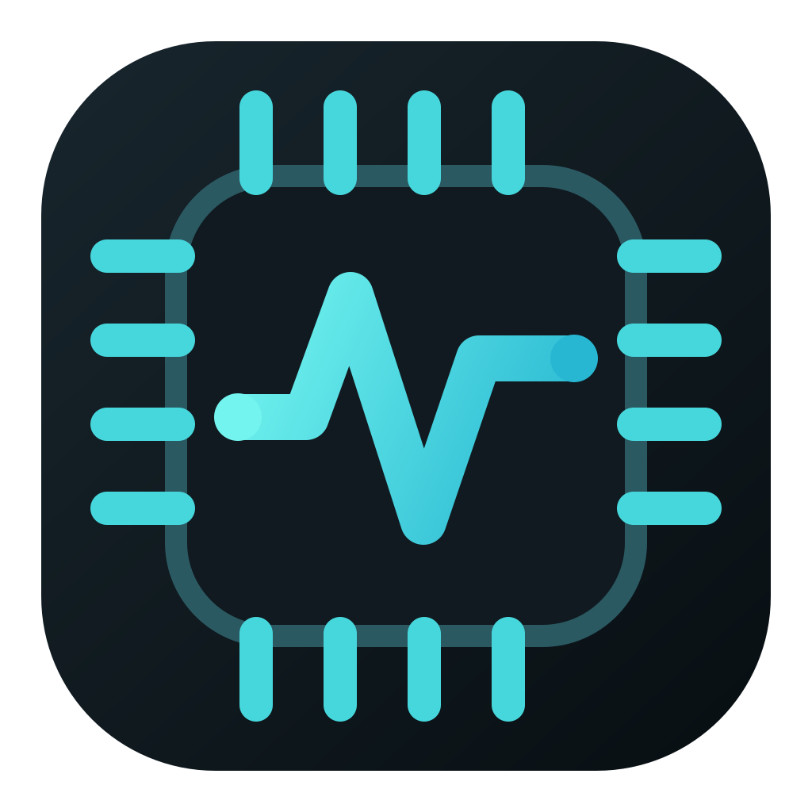
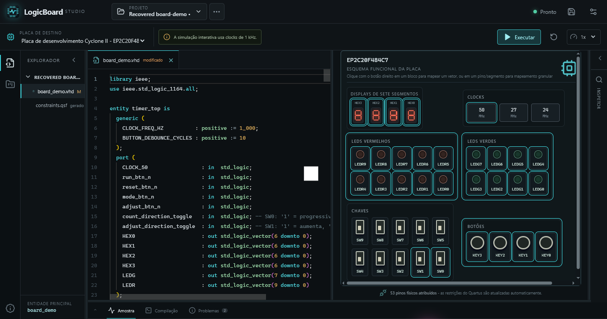

<div align="center">
  
  <h1>LogicBoard Studio</h1>
  <p><strong>Write VHDL, wire real FPGA pins, and watch your design come alive on a virtual board.</strong></p>
  <p>
    
    
    
  </p>
  <p>
    <a href="../../releases/latest"><strong>Download the latest Windows release</strong></a>
    ·
    <a href="#build-the-installer-yourself">Build it yourself</a>
  </p>
</div>



LogicBoard Studio is a desktop learning and development environment for the Cyclone II `EP2C20F484C7` starter board. It brings the pieces of a small FPGA project into one focused workspace: a Monaco VHDL editor, project files, pin assignments, a board you can interact with, compiler diagnostics, and live simulation powered by GHDL.

The name is intentional. **LogicBoard** describes what makes the application different: you do not only edit HDL—you connect it to a recognizable board and interact with the design. “FPGA Studio” would be more generic and could imply synthesis, programming, and broad device support that are not part of the application yet.

## What you can do

- Start from a blank project or a working, commented example.
- Edit multi-file VHDL projects with VHDL-aware syntax highlighting.
- Map entity ports to switches, buttons, LEDs, seven-segment displays, and clocks.
- Analyze VHDL-2008 sources with GHDL and inspect the complete compilation report.
- Run an interactive simulation and operate the virtual board while it is running.
- Save projects as normal folders with a small, versioned manifest.

## Install LogicBoard Studio

The easiest route is the Windows installer attached to the [latest GitHub Release](../../releases/latest). Download the `LogicBoard-Studio-...-setup.exe` asset, run it, and follow the installer.

GHDL is bundled with release builds, so end users do not need to install a simulator separately. LogicBoard Studio uses Microsoft Edge WebView2, which is already present on current Windows 10 and Windows 11 installations. Until releases are code-signed, Windows SmartScreen may ask you to confirm that you trust the downloaded installer.

> **Repository setup note:** the release link becomes active after this repository is pushed to GitHub and its first `v*` tag runs the included release workflow.

## Learn the workflow

### 1. Create a project

Open the project menu and choose **New Project**. Begin with **LED / switch mirror** if this is your first session: it provides a complete top-level entity and mappings that are easy to understand.

A saved project is an ordinary folder:

```text
my-project/
├── logicboard.project.json   # project name, board, sources, top entity, assignments
├── constraints.qsf          # generated pin constraints; do not edit by hand
└── src/
    └── top.vhd              # your editable VHDL source
```

The manifest controls source order and the selected top-level entity. Keeping the HDL in `src/` makes a project portable and easy to inspect without LogicBoard Studio.

### 2. Describe the circuit in VHDL

Declare the signals you want to expose as ports on the top-level entity. For example, this concurrent assignment sends switch zero directly to LED zero:

```vhdl
library ieee;
use ieee.std_logic_1164.all;

entity switch_to_led is
  port (
    SW0  : in  std_logic;
    LED0 : out std_logic
  );
end entity;

architecture rtl of switch_to_led is
begin
  LED0 <= SW0;
end architecture;
```

### 3. Connect ports to the board

Right-click a compatible board device and assign it to a top-level port. LogicBoard Studio checks direction and width—for example, an input switch cannot drive an output-only port, and a vector mapping must have the expected number of bits.

The generated `constraints.qsf` records the physical Cyclone II pin locations. This separates the circuit description from board-specific wiring.

### 4. Analyze and simulate

Choose **Run**. LogicBoard Studio analyzes all project sources as VHDL-2008, builds a temporary testbench, and starts GHDL. The bottom panel then exposes compilation details, problems, and sampled signal activity.

Board clocks retain their real hardware frequencies in the project model, while interactive simulation uses a slower model so changes remain visible and controllable. This is a learning-oriented simulation—not synthesis or FPGA programming.

## Develop from source

### Prerequisites

Install the following on Windows:

1. [Node.js LTS](https://nodejs.org/) and npm.
2. [Rust](https://www.rust-lang.org/tools/install) with the stable MSVC toolchain.
3. [Microsoft C++ Build Tools](https://visualstudio.microsoft.com/visual-cpp-build-tools/) with **Desktop development with C++** selected.
4. [GHDL](https://github.com/ghdl/ghdl) for local analysis and for building the installer.

GHDL can be installed from PowerShell with:

```powershell
winget install --id ghdl.ghdl
```

Then open PowerShell in the repository root and install the JavaScript dependencies:

```powershell
npm install
```

Start the desktop application in development mode:

```powershell
npm run tauri dev
```

The first Rust build takes longer because Cargo compiles the desktop dependencies. Later launches reuse that cache.

### Useful checks

```powershell
npm test          # run the frontend unit suite
npm run build     # type-check and build the frontend
cd src-tauri
cargo test        # run the Rust backend suite
```

## Build the installer yourself

From the repository root, run:

```powershell
npm ci
npm run build:windows
```

`build:windows` finds GHDL on `PATH`, through `GHDL_HOME`, or in the WinGet package directory. It copies that distribution into the Tauri resources and creates an NSIS setup executable at:

```text
src-tauri/target/release/bundle/nsis/LogicBoard Studio_<version>_x64-setup.exe
```

Install it like any other Windows application. The default Tauri NSIS mode installs for the current user and does not require administrator privileges.

## Create a GitHub Release

The workflow in `.github/workflows/release.yml` turns every pushed `v*` tag into a tested Windows release. Before tagging, update the same version in `package.json`, `src-tauri/Cargo.toml`, and `src-tauri/tauri.conf.json`, move the changelog entries out of **Unreleased**, and run the checks above.

```powershell
git tag -a v0.6.1 -m "LogicBoard Studio 0.6.1"
git push origin v0.6.1
```

GitHub Actions then installs the toolchains, runs both test suites, bundles GHDL, creates the NSIS installer, and publishes it as a release asset. Use the actual version you prepared instead of copying `v0.6.1` for every release.

## Supported board devices

| Device | Available resources |
| --- | ---: |
| Toggle switches | 10 |
| Active-low pushbuttons | 4 |
| Red LEDs | 10 |
| Green LEDs | 8 |
| Seven-segment displays | 4 |
| Clocks | 50 MHz, 27 MHz, and 24 MHz |

## Regenerate the icon set

`public/logicboard-icon.svg` is the single editable source for the application identity. After changing it, regenerate every Tauri platform size with:

```powershell
npm run icons
```

The app header uses that same SVG, so the workspace branding, executable, installer, and generated platform assets stay visually aligned.

## Project status

LogicBoard Studio currently targets one Cyclone II starter board and VHDL-2008. It analyzes and simulates designs; it does not yet synthesize a bitstream or program physical hardware. See [roadmap.md](roadmap.md) for planned work and [changelog.md](changelog.md) for completed releases.

---

Built by [Pablo Santana de Oliveira](https://pablosan.netlify.app/).
